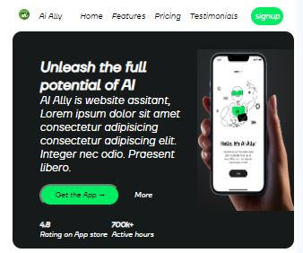
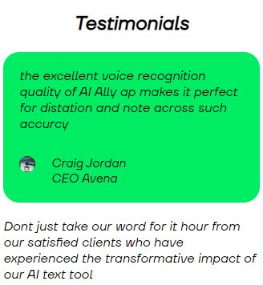

1) Project Name.
# AI ALLY

2) Project view.

3) ## About
this is website landing page aimed at advertising and making known the wonderful features offered by the AI Ally application

4) Project Technical.
## Built With
- Html
- Css

### Prerequisites
Knowledge about HTML:
- Basic html and css syntax
- tags

## Clone project
- To get a local copy up and running follow these simple example steps.
- Clone this repository with
`https://github.com/solonkonora/proffesional-design.git` using your
terminal or command line.
- Change to the project directory by entering: cd proffesional-design
in the terminal.

5) ##Live Site
[link](https://solonkonora.github.io/proffesional-design/)

## Author
👤 **Nora Solonko**